# DtBlkFx Revision 1.1

*VST audio effect plugin by Darrell Tam*

### User Guide

Compile date April 2008, Microsoft Windows version

This software incorporates code from *fastest-fourier-transform-in-the-west 3.1.2* ([www.fftw.org](http://www.fftw.org)), portable network graphics library code from *libpng*/*zlib* ([www.libpng.org](http://www.libpng.org)/[www.zlib.net](http://www.zlib.net)), *Steinberg VST plugin SDK 2.3* and Steinberg *VSTGUI 3.5*. VST is a trademark of Steinberg Media Technologies GmbH. User manual diagrams incorporate graphics from [ian.umces.edu](http://www.ian.umces.edu).

---

## The Description

*DtBlkFx* is a Fast-Fourier-Transform (FFT) based Virtual Sound Technology (VST) plug-in for use in a variety of audio software running under Microsoft Windows 2000 or newer.

This is a macOS port, built as a universal VST3 (Apple Silicon & Intel). It
targets macOS 10.13 or newer but has so far only actually been run and tested
on macOS 15.

Use it for...

- Precision parametric equalizing with sharp-roll off
  - Set the frequencies so accurately that you can adjust individual harmonics of a sound
  - Frequency resolutions of up to 0.7 Hz
- Harmonic based (or comb) filtering
  - Set a fundamental frequency and adjust the level of it and its harmonics - you can even remove the pitched component of a voice
  - Active harmonic tracking - let *DtBlkFx* automatically track a sound and adjust the level of it's harmonics
- Various types of noise control
  - Change the "contrast" between loud and soft frequencies
  - Adjust only those frequencies below or above a particular threshold
  - Clip frequencies above a particular threshold
  - Sound smearing (phase randomizing)
- Frequency shifting
  - Harmonic shifting by a fixed number of notes
  - Non-harmonic shifting by a fixed frequency
  - Active harmonic repitch - the pitch of your sound is monitored and shifted to a destination note (or matched to another channel)
- Various methods of mixing left and right channels
  - Standard Vocoding (frequency enveloping) - make your trumpet rap, string section sing or synthesizer talk
  - Harmonic based vocoding - harmonics in one channel are power-matched to those in the other (or some predefined waveforms) for a new vocoding sound
  - Convolution-like mixing
  - 2 new mixing algorithms
- Frequency masking
  - A harmonic or threshold mask may be set for any effect (apart from vocoding) - for example only shift frequencies that are below the threshold

You can select up to 8 of the above effects to be run in series! Combining the effects in this way allows you to make completely new and surprising sounds.

*DtBlkFx* is freely distributable and is covered by the terms of the GNU licensing agreement.

### Some really short theory

This effect works differently to most others - instead of filtering or distorting audio data directly, it finds the frequency spectrum via a fast-fourier-transform and then does stuff to that.

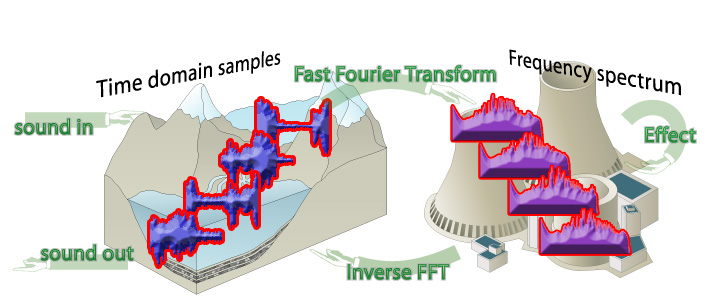

The steps are:

1. Cut input sample data into overlapping blocks
2. Transform each block to the frequency spectrum (this is called the fast-fourier-transform)
3. Apply some effects to the spectrum
4. Inverse transformed the frequency spectrum back to sample data
5. You feel satisfied

Note: The effect **must** delay the audio the length of at least a block. By default it is set to 1 beat but you can adjust this down to a fraction of a beat.

## The Tour

Here's the user interface from the Windows 1.1 version. (This port's GUI looks different — see the README for a screenshot.)

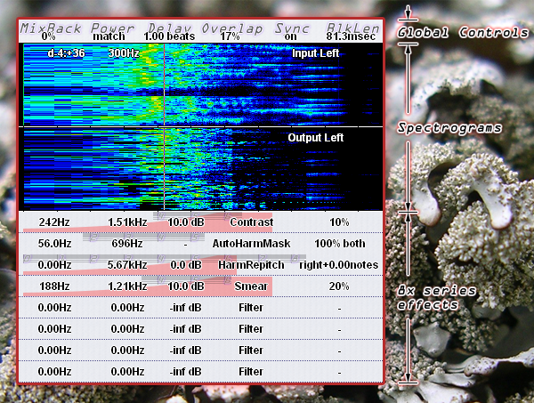

What is all that stuff? Read on...

### Overall Params

These are the parameters along the top.

| Parameter | Description |
| --- | --- |
| ***MixBack*** | Percentage mix back of original sound. Set this to 100% to save CPU if you don't want any effect apart from delay.  VstParam: MixBack |
| ***Power*** | Power can be set to *match* or *filter*.  *Match* causes the output "power" to be amplified or attenuated to be the same as the input "power". This means individual effect amplitudes are relative to one another. It also means that if you remove a large portion of your frequency spectrum then left over stuff may end up sounding very loud.  *Filter* mode operates like a traditional filter where the output power may be very different to the input power. This mode is of most use when using *DtBlkFx* as a parametric equalizer.  VstParam: MixBack shared parameter, if MixBack param < 0.5 then power is *match* otherwise power is *filter*. |
| ***Delay*** | Since *DtBlkFx* processes audio in blocks it **must delay the sound to operate**. *Delay* controls the amount of delay introduced in music-beats.  Hopefully this isn't too painful because if you shift your audio track forward by the same number of beats then all the timing is back to normal. I have had quite a few "complaints" about the delay! But that is just how this effect works!!  The maximum block size that can be processed is limited by the delay that you specify (i.e. small delays will only allow small block sizes).  VstParam: Delay |
| ***Overlap*** | Percentage overlap of blocks to use. A large overlap results in a smooth transit ions between blocks but more CPU while a smaller overlap can give interesting effects.  VstParam: Overlap |
| ***Sync*** | If *sync* is turned on then DtBlkFx will try align the blocks with the song tempo and any parameter changes. When turned off then the position of blocks will have no particular relationship with the song tempo.  VstParam: Shared with Overlap param (*on* when > 0.5) |
| ***BlkLen*** | Specify the maximum length of block to process audio data.  If the specified *Delay* is less than the *BlkLen* specified then a smaller block length will be used and displayed with an asterisk (*).   Longer block lengths give a higher frequency resolution but need more delay and CPU. Short block lengths can introduce interesting artefacts.  VstParam: BlkLen |

### Spectrograms

The spectrograms show the frequency content of the sound before (Input Spectrogram) and after (Output Spectrogram) processing by *DtBlkFx*. The colour represents the amount of sound energy at each frequency.

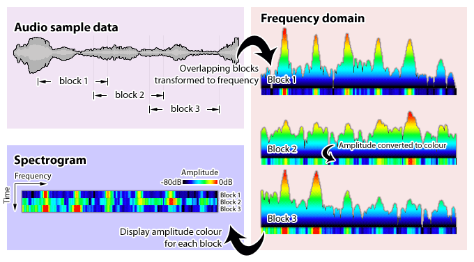

Move the mouse over either to see a frequency and note display. Click for a menu to select which channel (or both or paused) from the input or output to display. Pausing lets you inspect it more conveniently and saves CPU.

How does it work? Each line of the spectrogram is generated from one block (or more for small block sizes) of FFT'd data. The vertical axis is time with most recent data scrolling in at the bottom. The horizontal axis shows frequency with 0Hz on the far left and the maximum frequency (i.e. 22050Hz for 44.1Khz sampling) on the far right. The colour indicates the power level of each frequency: red is -13 dB, black is -80 dB.

For the mathematically inclined... the horizontal scaling is linear over *octaves* (which is how we perceive sound) instead of *Hz* (it is *logarithmic* over *Hz* meaning that high frequencies are closer together than low frequencies). Since FFT's work linearly over *Hz* there is less frequency resolution (i.e. wider *bins*) at low frequencies.

### Effects

Up to 8 *DtBlkFx* effects can be applied to the frequency spectrum. The effects are applied in series.

Each effect line in the user interface consists of 5 parameters as shown below.

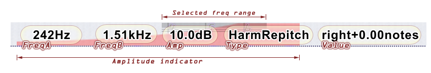

Note that the numbers in the selected frequency range correspond to *C* octave - e.g. "4" is the frequency of *C-4*.

| Parameter | Description |
| --- | --- |
| ***FreqA / FreqB*** | Use these to select a frequency range for the effect. The frequency is displayed in Hertz and the selected range is shown in *inverse* on the *spectrograms*.  For non-harmonic effects *FreqA* & *FreqB* are used to select or exclude a frequency range to process. Set *FreqA* less than *FreqB* to include the region between them otherwise the range is excluded.  
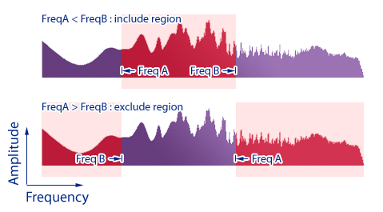
 Use the smallest possible frequency range for an effect to save on CPU.  Right-click-drag on *FreqA* or *FreqB* to slide both at once.  VstParam: \<n\>: FreqA / \<n\>: FreqB |
| ***Amp*** | *Amplitude* controls the amplitude of the selected frequency range for effect. For some effects it controls the mix-back amount (wet to dry ratio).  If the overall *power* parameter is set to *match* then the gain/attenuation is relative - raising the *Amplitude* of the selected frequency range effectively decreases that of the other frequencies.  VstParam: \<n\>: Amp |
| ***Type*** | *Type* controls which effect will be run. The possible effects are described in the next section.  VstParam: \<n\>: Type |
| ***Value*** | The meaning of *value* depends on which effect *type* has been selected.  VstParam: \<n\>: Value |

### Effect types

The effect type is selected from the *Type* pop-up menu for each effect position.

There are 2 categories of effects as described below: *Normal* and *Masking*.

***Normal Effects***

| Effect | Description |
| --- | --- |
| ***Filter*** | Parametric equalizer - adjust the amplitude of the frequency range specified. This does not use the effect *value* control.  Some of the other effects have this capability too but will tend to use more CPU if this is all you want to do. |
| ***Contrast*** | *Contrast*  changes the dynamic range of frequencies present in the sound.    Positive contrast results in the reduction of noise and softer frequency components. Small amounts are useful for reducing distortion and un-muddying sound. When applied heavily only the loudest tones remain but can end up sounding like nasty audio compression on dodgey web videos.   Negative values flatten the frequency spectrum and increase noise. Small to medium amounts are useful for adding "body".  
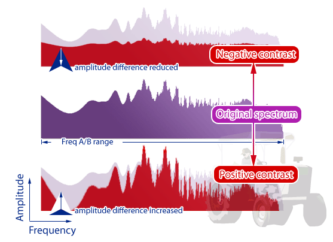
 |
| ***Smear*** | Randomizes the phase of the spectrum data which results in a flattening of the sound envelope. Sound smearing can be used to remove loop clicks and give a sustain effect.  Similar to reverb in other plugins except that outcome is both forwards and backwards in time! |
| ***Thresh*** | Boost or reduce frequency components with an amplitude above or below a particular threshold (set by the effect *value*) within the selected frequency range.  
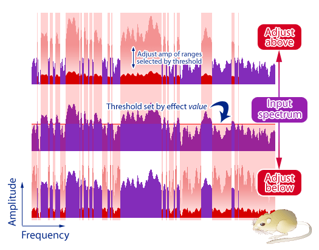
 You can get a similar sound to *contrast*. In previous versions of *DtBlkFx* this was known as "Weed". |
| ***Clip*** | Clip frequency components greater than a particular level (set by the effect *value*).  
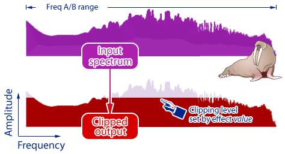
 |
| ***Resize*** | The *resize* effect takes the selected range(s) and resizes them about the centre of each range.   The effect *value* controls the amount of *resize* and whether to reverse in time and/or frequency.   
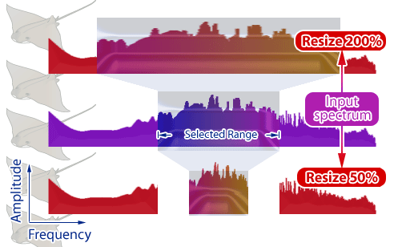
 Squeezing the spectrum (resizing less than 100%) results in a pitch shift towards the range centre and also slows down the sound in time. Expanding the spectrum (resizing greater than 100%) tends to make the block repeat.  For some fun try in combination with the masking effects. |
| ***Resample*** | Resample is just the same as what resample normally does - it changes the pitch and speed together.  
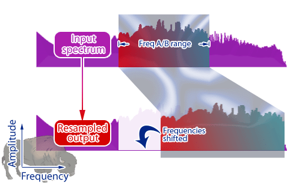
 When used with long block sizes (>300msec) you can hear the segment of sound being repeated. If you use it with medium sizes (say 50msec) it becomes more of a pitch shifting effect.  It is easy to get lots of clicking and popping with this effect - one way to remove is to set a threshold mask for less than 40% (say) followed by a 100% smear afterwards. Check the *resample* preset for this. |
| ***Shift*** ***ShiftConst*** | Modify the pitch of the selected spectrum.  *Shift* changes the pitch by a constant number of *notes* while *ShiftConst* shifts by a fixed number of *Hertz* .   The constant shift mode may be similar to frequency modulating effects or listening to single-side-band CB radios. It tends to give a metallic quality as the sound loses its normal harmonic relationships.   Shift resolution is affected by the block length - longer lengths result in higher shifting resolution. |
| ***HarmShift*** ***HarmRepitch*** | Harmonic frequency shift by a constant number of notes (*HarmShift*) or to a particular note (*HarmRepitch*). The stereo version of *HarmRepitch* can also pitch match the left channel to the right channel - this is displayed as `right+`*notes* in the effect value.  These effects will only work correctly on single voice or single note sounds (i.e. a chord won't be properly pitch shifted). *HarmShift* is similar in function to *Shift* except it will generally do a better job for a single voice sound.  
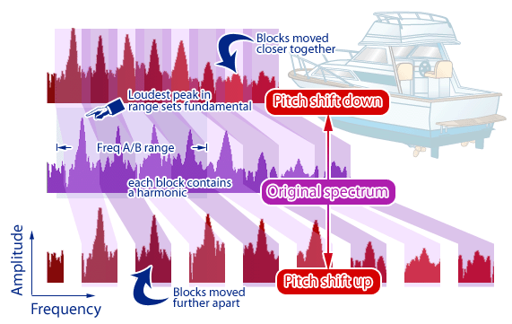
 *DtBlkFx* shifts the frequency spectrum in blocks that are aligned to harmonics of the sound (shown in alternating pink & blue). The fundamental frequency (centre of the first block) is automatically set to the loudest tone below 1/8th of the sample rate (i.e. 5.5Khz/F-8 at 44.1Khz sampling).   Use the *AutoHarmMask* effect (described later) in the effect position immediately previous to control harmonic *width* and *all/even/odd/between* setting (refer oto the *HarmFilt* diagram) . In this case the fundamental is found from the loudest peak within the *AutoHarmMask* *FreqA/B* range (instead of below 1/8th of the sample rate).  Note that the *DtBlkFx's* spectrogram display will not show the harmonic ranges as equally spaced as shown above because of the way it spaces the frequencies (logarithmic). |
| ***HarmFilt*** | *HarmFilt* (Harmonic Filter) is a comb filter that allows you to modify amplitude at regular intervals or *harmonics* but leave the gaps between unchanged. You can use this to control the amplitude of a particular note or to produce interesting sweeping effects (similar to "phasing"). Be sure to set the effect *Amp* to be non-0 dB (e.g. try -inf or +40 dB) to make the effect do something.  
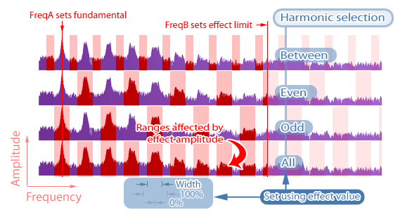
 The above diagram shows the possible frequency ranges selected by the effect (semi-transparent red squares). The *fundamental* frequency corresponds to which ever *FreqA/FreqB* control has a lower frequency while the other controls the maximum frequency limit.  The effect *value* sets the width around each harmonic and which harmonics you want to modify - all, dd, even or between.   Note that the *DtBlkFx's* spectrogram display will not show the harmonic ranges as equally spaced as shown above because of the way it spaces the frequencies (logarithmic). |
| ***AutoHarm*** | *AutoHarm* is similar to *HarmFilt* except that the fundamental frequency is automatically determined as the loudest tone below 1/8th of the sample rate (i.e. 5.5Khz/F-8 at 44.1Khz sampling). Use this to automatically track a pitched sound and change its amplitude.  
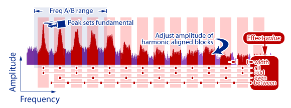
 The harmonic *width* and *all/odd/even/between* setting is controlled by the effect value (see *HarmFilt*). |
| ***Triangles*** ***Squares*** ***Saws*** ***Pointy*** ***Sweep*** | These effects change the timbre of a pitched input sound by power matching harmonics to various built-in envelopes. Like *AutoHarm, HarmShift & HarmRepitch* these effects only work as described on a single voice or note and the fundamental is automatically determined from the loudest tone below 1/8th of the sample rate (i.e. 5.5Khz/F-8 for 44.1Khz sampling)  
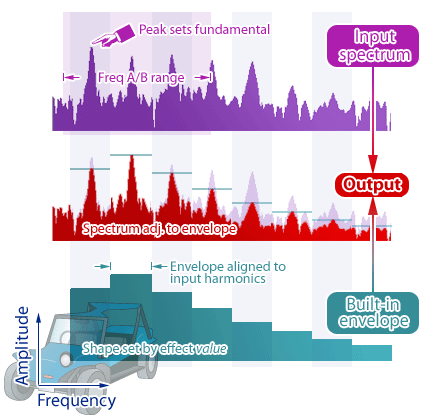
 The effect *value* varies the harmonic envelope according to a built-in sequence of envelopes.   Use the *AutoHarmMask* effect (described later) in the effect position immediately above to control harmonic *width* and *all/even/odd/between* setting (refer oto the *HarmFilt* diagram) . In this case the fundamental is found from the *AutoHarmMask* *FreqA/B* range while the *HarmShift/HarmRepitch FreqA/B* range specifies the inclusion or exclusion range. |
| *DoNotUse* | Effects marked *DoNotUse* don't do anything - they are called this because I may put an effect there in future. |

***Mask Effects***

*Mask* effects don't change the sound in anyway by themselves but affect which frequencies a *normal* effect immediately following will be applied.  For example if you set the first effect as *ThreshMask* and the second effect as *Contrast* you can now choose to apply *Contrast* only to frequency components above or below the threshold.

Masks will operate with any other non-mask effect unless specifically noted.

Note: A normal effect can only have one mask (i.e. if you set 2 masks in a row then the first mask will be ignored).

| Effect | Description |
| --- | --- |
| ***HarmMask*** | *HarmMask* is the masking version of *HarmFilt* and allows you to apply any normal effect to the harmonics of a particular note. |
| ***AutoHarmMask*** | *AutoHarmMask* is the masking version of *AutoHarm* and has the same effect *value* meaning. |
| ***ASubH1Mask*** ***ASubH2Mask*** ***ASubH3Mask*** | These effects are all variants of *AutoHarmMask* differing in that the fundamental frequency is taken as 1/2 (*ASubH1Mask*), 1/3 (*ASubH2Mask*) or 1/4 (*ASubH3Mask*) of the loudest frequency component within the selected range. |
| ***ThreshMask*** | Thresh mask is the masking version of *Thresh* and lets you apply the following "normal" effect to only frequencies above or below a particular threshold. |

***Stereo Only Effects***

These effects require 2 channels to operate.

| Effect | Description |
| --- | --- |
| ***Vocode*** | *Vocode* mixes the two channels by taking the frequency envelope of the left channel and applying it to the right channel (with the result in both the left and right).  Example: feed voice into the left channel (red spectrum) and some strings into the right (blue spectrum). *DtBlkFx* will mix the voice and the strings to produce talking strings (which is just just what we need).  
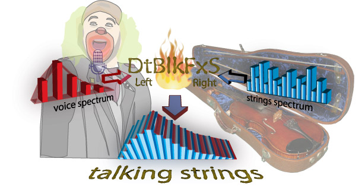
 *Vocode* takes the frequency envelope of the left channel and applies it to the right channel. It operates by dividing the spectrum into a number of blocks (controlled by effect *value*) and adjusting the amplitude of each block from the right channel so as to power-match with the corresponding block in the left channel.  When *FreqA* < *FreqB* then processing on the right channel is limited to that range while the entire spectrum is used from the left channel. If *FreqB* < *FreqA* then the entire spectrum of the right channel is processed while the envelope from the left channel is limited to the *FreqB-FreqA* range.  Mask effects are not supported and will do nothing. |
| ***HarmMatchLR*** ***HarmMatchRL*** | *HarmMatchLR & HarmMatchRL* match the power from each harmonic in one channel to the corresponding harmonic in the other resulting in a different type of vocoding.  *HarmMatchLR* uses the left channel as a reference and adjusts the right channel to match while *HarmMatchRL* goes the other way (right is reference, left is adjusted). Both versions of the effect output the adjusted channel on both left & right channels (i.e. reference is not output) and always set the overall output power to match the left channel.  
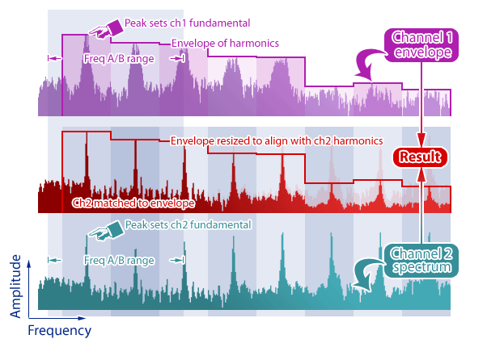
 The fundamental frequency (centre of the first block) for each channel is automatically set by the loudest peak within the *FreqA/FreqB* range. The effect *value* controls the harmonic *width* and *all/odd/even/between* setting. Refer to *AutoHarm* for more information - as with all other harmonic effects these only work as described for single voice sounds (although it will do interesting things on chords).  Use *AutoHarmMask* in the effect position immediately above to allow individual control over channel 1 & channel 2. The *AutoHarmMask* settings (*FreqA/FreqB* & *value*) refer to channel 1 while the *HarmMatch* settings refer to channel 2 - this means you can set different fundamental search ranges and harmonic settings for each channel.  *ThreshMask* and *HarmMask* are not supported and will do nothing.  The above diagram differs from what you will see in the spectrogram because of a different frequency scale (logarithmic). |
| ***CrossMix*** | *CrossMix* combines the left & right channels by multiplying the frequency components (time-convolution) of the selected range(s).  The *value* controls the ratio of left to right mix and which channel will be output for all other frequencies.  
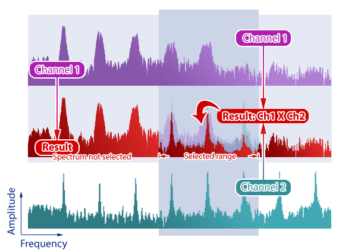
 |
| ***WarpMix*** | *WarpMix* produces an output by warping and combining the frequency spectrum of the left and right channels as follows:  1. Divide the spectrum of each channel into segments of equal power (the number of segments is determined by the *Amp* percentage in for *mode-1 WarpMix*) 2. Resize each segment to a frequency and width intermediate to both channels (determined by the effect *value*) 3. Add the resized segments together using a ratio determined by the effect *value*  
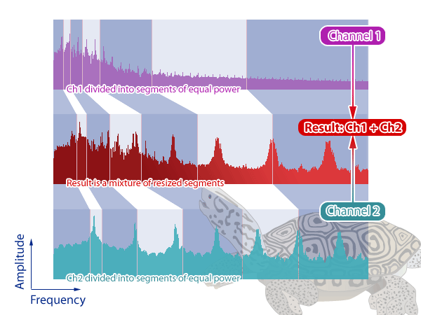
 The effect *value* also controls what mode *WarpMix* should operate in. *Mode-1* proceeds as shown above while *Mode-0* divides the spectrum into as many segments as there are frequency bins. |

## Reducing CPU usage

DtBlkFx can be quite hard on your CPU! How can you reduce it?? Try these...

- Reduce the *overlap* as much as possible - for example 85% overlap uses quadruple the CPU as 40% overlap!
- Set the *MixBack* to 100% if you don't want any effect to be run (but keep the delay) instead of tweaking effects to do nothing
- Turn off "inactive" effects by setting both frequencies to the same (for example, 0 Hz)
- Set the smallest frequency range possible for each effect, particularly at the top end (the very top octave corresponds to 1/2 of the total processing for an individual effect)
- Try to use block sizes between 512 and 16384 samples
- Turn off *Sync* if you don't need it, particularly on larger blk sizes - extra blocks may be processed on each beat if it is turned on
- Increase the delay so that full blocks can be processed - forcing *DtBlkFx* to process partial blocks will use more CPU (*BlkSize* is marked with an asterisk on the user interface )
- Close the user interface if you don't need it or at least pause the spectrograms - generating & scrolling the graphics eats CPU

## Tutorials

I agree this would be good... If anyone wants to write some, please do!

Have a look through the presets for some hints.

## Other stuff

All of the graphics components (*32 bit portable network graphics* format) for the user interface and the presets are stored in the *dtblkfx* directory. Feel free to customize!

*DtBlkFx* is freely distributable and is covered by the same terms as the GNU licensing agreement.

The *Fastest-Fourier-Transform-in-the-West* (version 3.1.2) is used to perform frequency transforms. Many thanks to everyone that made FFTW (please see [http://www.fftw.org/fftw3_doc/Acknowledgments.html](http://www.fftw.org/fftw3_doc/Acknowledgments.html)) *libpng/zlib* (please see [www.zlib.net](http://www.zlib.net/) and [www.libpng.org/pub/png/libpng.html](http://www.libpng.org/pub/png/libpng.html)) and VSTSDK/VSTGUI (please see [ygrabit.steinberg.de/~ygrabit/public_html/index.html](http://ygrabit.steinberg.de/~ygrabit/public_html/index.html)).

## Contact

*DtBlkFx* was originally written by Darrell Tam. This is a macOS port maintained
separately from the original author — please direct bug reports, comments and
suggestions about this build to its repo rather than to Darrell, since issues
here may well have been introduced by the port rather than the original engine.

| Field | Value |
| --- | --- |
| Original Author | Darrell Tam |
| Bug reports (this port) | [github.com/miruu-xyz/dtblkfx_mac](https://github.com/miruu-xyz/dtblkfx_mac/issues) |
